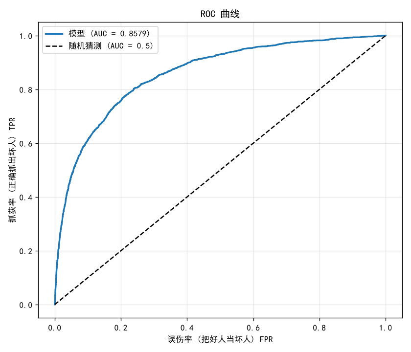
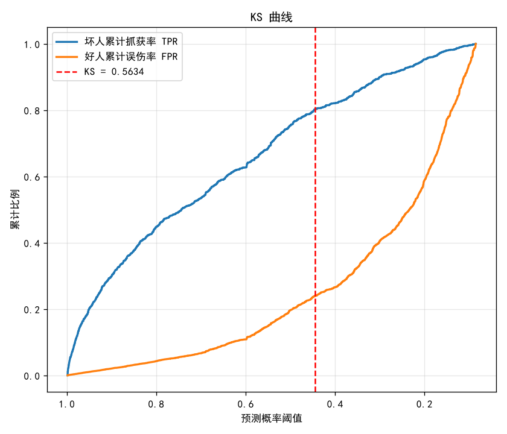
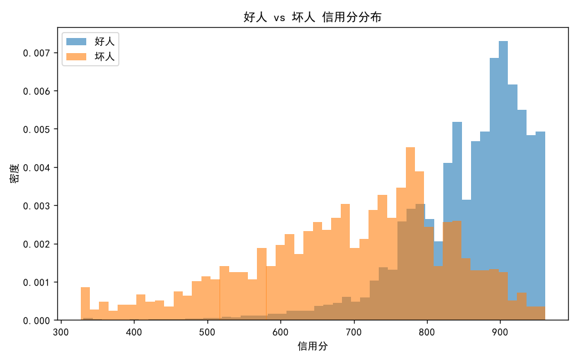
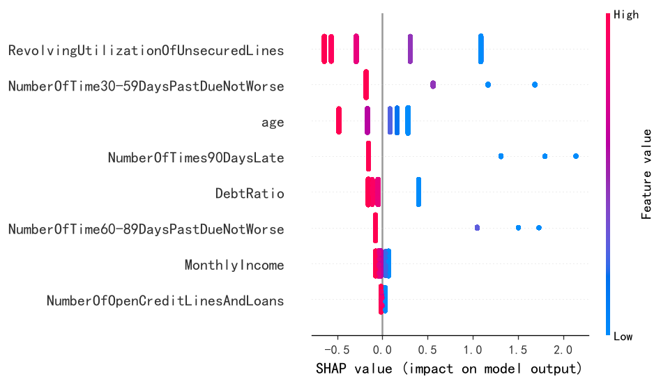
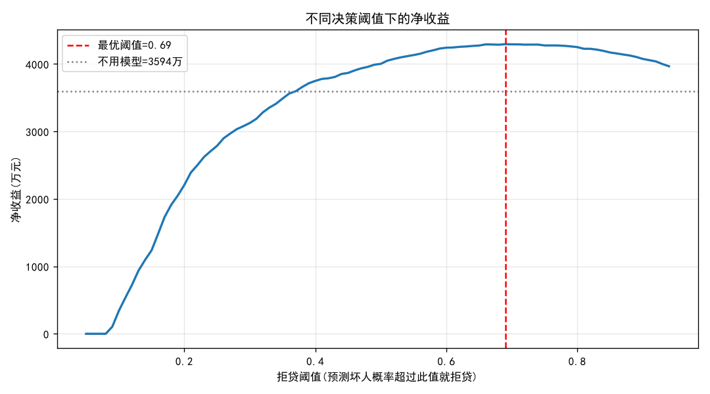

# 个人信贷违约预测与信用评分卡

> 基于 Kaggle "Give Me Some Credit" 数据集（15 万条真实信贷数据），
> 独立完成从数据清洗到业务价值量化的端到端信用风险建模。

## 项目背景

银行与消费金融机构的核心风控问题：**判断一个借款人未来两年是否会发生严重逾期**，
从而决定是否放贷。本项目构建信用评分卡模型来解决这一问题。

## 核心成果

| 指标 | 结果 |
|------|------|
| 模型 AUC | 0.86|
| 模型 KS | 0.56 |
| 坏账率改善 | 6.68% → 3.37%（↓ 49.5%） |
| 估算年化增收 | 约 2.3 亿元（百万客户规模） |
| 过拟合情况 | 无（训练/测试 AUC 差异 < 0.01） |

## 技术栈

`Python` · `pandas` · `numpy` · `scikit-learn` · `SHAP` · `matplotlib`

## 建模流程

| 阶段 | 脚本 | 说明 |
|------|------|------|
| 1. 数据探索 (EDA) | w1_eda.py| 识别样本不平衡(坏人6.7%)、缺失值、异常值 |
| 2. 异常值侦查 | w2_check.py| 定位逾期字段中的异常采集码 96/98 |
| 3. 数据清洗 | w2_clean.py| 缺失值填补 + 异常值处理 |
| 4. 特征工程 | w3_woe_iv.py| WOE/IV 分箱与变量筛选 |
| 5. 模型训练 | w4_model.py| 逻辑回归 + 防数据泄露的训练/测试隔离 |
| 6. 模型评估 | w5_evaluate.py| ROC/AUC、KS、PSI 稳定性 |
| 7. 评分卡 + 解释 | w6_scorecard.py| 标准评分卡转换 + SHAP 可解释性 |
| 8. 业务价值量化 | w7_business_value.py| 最优决策阈值求解与收益测算 |

## 项目亮点

批判性思维：发现关键逾期变量 IV 异常接近 0，排查后定位根因为"零膨胀变量上等频分箱失效"，改用业务含义分箱后 IV 回升至 0.6+，  并清晰呈现"逾期越多、坏账率越高"的单调风险趋势。
防数据泄露：所有 WOE 分箱规则仅从训练集学习，再应用到测试集，  避免未来信息污染模型。
可解释性：将逻辑回归转换为标准信用评分卡（Base=600, PDO=50），  并用 SHAP 做单客户级别的归因，满足金融监管对拒贷理由告知的要求。
业务导向：将模型指标转化为坏账率与净收益，回答"模型到底值多少钱"。

## 项目结构

​```
credit-scorecard/
├── README.md
├── w1_eda.py              # 数据探索
├── w2_check.py            # 异常值侦查
├── w2_clean.py            # 数据清洗
├── w3_woe_iv.py           # 特征工程(WOE/IV)
├── w3b_late_check.py      # 逾期变量IV修正验证
├── w4_model.py            # 模型训练
├── w5_evaluate.py         # 模型评估(ROC/KS/PSI)
├── w6_scorecard.py        # 评分卡 + SHAP
├── w7_business_value.py   # 业务价值量化
└── *.png                  # 结果图表
​```

## 结果展示

### ROC 曲线（AUC = 0.86）


### KS 曲线（KS = 0.56）


### 好人 vs 坏人 信用分分布


### SHAP 特征重要性


### 不同决策阈值下的净收益


## 数据说明

数据来自 Kaggle 公开竞赛 [Give Me Some Credit](https://www.kaggle.com/c/GiveMeSomeCredit)，共 15 万条样本、10 个特征。因数据使用协议，本仓库不包含原始数据文件，运行前请自行从 Kaggle 下载 `cs-training.csv` 放入项目目录。
